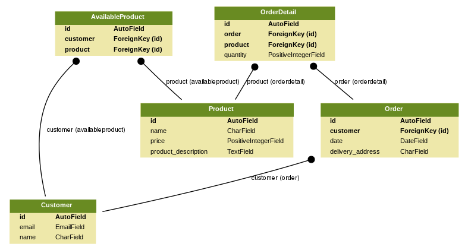

# Examen Práctico de Programación Django - Grupo MeiKo SAS

Su labor consiste en realizar un conjunto de servicios para un sistema que permite realizar órdenes de productos. 
El proyecto contiene las siguientes entidades:



| Tabla | Descripción |
| ------------- | ------------- |
| Customer | Quienes realizan las ordenes |
| Product | Cosas que se pueden comprar |
| Order | Pedidos realizados por los clientes |
| OrderDetail | Productos comprados por los clientes |
| AvailableProduct | Productos que pueden comprar clientes |

## Parte 1 - Completar el código

Su lider de desarrollo le ha pasado una base de código que debe ser completada para el funcionamiento del proyecto, se 
deben realizar las siguientes tareas:

1. Completar el metodo `get_total` en la clase `OrderSerializer`. El método debería retornar el total de una orden
basado en su detalle.
```python
def get_total(self, order):
  #sum(precio_producto * cantidad)
  pass
``` 

2. Completar el metodo `get_products` en la clase `OrderSerializer`. El método debería retornar los productos y la 
descripción separados por coma.
```python
def get_products(self, order):
  # productos separados por coma
  pass
``` 

3. Completar el metodo `create` en la clase `OrderSerializer`. El método permite la creación de la orden, este metodo
recibe el detalle de la orden en la que se especifica el `product_id` y `quantity`.
```python
def create(self, validated_data):
  """
  Create and return a new `Order` instance, given the validated data.
  """
  pass
``` 

4. Completar el metodo `update` en la clase `OrderSerializer`. El método solo permite actualizar el `delivery_address`.
```python
def update(self, validated_data):
  """
  Update and return an existing `Order` instance, given the validated data.
  """
  pass
```

## Parte 2 - Seguimiento y Auditoria

Las politicas empresariales especifican que se debe realizar seguimiento a todos los registros, para esto se ha creado 
la clase `Auditor` disponible en `utils.django.db.models`. Su tarea consiste en modificar las clases del modelo para
realizar auditoria sobre los registros.

```python
from utils.django.db.models import Auditor

class Product(Auditor):
    pass
```

La clase `Auditor`, garantiza que cuando los registros se borren; cambien a estado inactivo. Así mismo, permite realizar
seguimiento por fechas y usuarios en los registros. Implemente estrategias para que los datos actuales no se vean 
afectados por la implementación.
 
## Parte 3 - Crear servicios API-REST

Se solicitan crear los siguientes servicios.

1. ***Crear una órden*** para un cliente con hasta máximo 5 productos. Tenga en cuenta que sólo algunos productos están 
permitidos por cliente.

```json
{
  "customer": 1,
  "delivery_address": "Diagonal 86a # 101 - 40",
  "date": "2018-10-06",
  "order_details": [
    {
      "product_id": 1,
      "quantity": 2
    },
    {
      "product_id": 2,
      "quantity": 1
    },
    {
      "product_id": 3,
      "quantity": 41
    },
    {
      "product_id": 4,
      "quantity": 54
    }
  ]
}
```

2. ***Listar las órdenes*** de un cliente por un rango de fechas.

```json
[
    {
        "customer": 1,
        "id": 1,
        "delivery_address": "Calle 26c #13-97",
        "date": "2018-10-01",
        "total": 42271,
        "products": "12 x Arroz,14 x Azúcar,17 x Consomate"
    },
    {
        "customer": 1,
        "id": 2,
        "delivery_address": "Calle 26c #13-97",
        "date": "2018-10-01",
        "total": 31396,
        "products": "47 x Sopa,47 x Consomate"
    }
]
```

Es posible realizar filtros por los siguientes parametros customer, date o data__range:

```
http://localhost:8000/invoice/order/?format=datatables&customer=1, if you want filter only by customer
http://localhost:8000/invoice/order/?format=datatables&customer=1&date=2018-10-01, if you want filter by customer and specific date
http://localhost:8000/invoice/order/?format=datatables&customer=1&date__range=2018-10-01,2018-10-05, if you want filter by customer and specific range date
```

3. ***Crear clientes*** automaticamente se agrega la fecha de creación y el usuario creador es test.
4. ***Lista clientes*** 
5. ***Actualizar clientes*** automaticamente se agrega la fecha de actualización y el usuario actualizador es test.
6. ***Borrar clientes*** recuerda que no se borran los registros, se desactivan.

## Parte 4 - Seguridad

Los servicios en este momento estan expuestos, se debe garantizar que sean consumidos por clientes deseados, para esto
se usa una autenticación por medio de tokens. Realice lo siguiente:

1. Modifique adeacuadamente la variable `REST_FRAMEWORK` en `settings.py` para implementar la seguridad.
2. Se reporto un comportamiento no deseado: Cuando el usuario ingresa email o contraseña invalidos el servicio arroja
error 500, modifiquelo para que retorne código 422.

## Parte 5 - Pruebas Unitarias

Complemente el archivo `test.py` creando sus propias pruebas basado en los datos iniciales. Se evaluara la calidad de
pruebas realizadas.

## Parte 6 - Instalar libreria y automizar bash

1. Su cliente va a implementar `DataTables` para consumir el servicio de ordenes. Instale y configure la libreria 
[django-rest-framework-datatables](https://django-rest-framework-datatables.readthedocs.io/en/latest/). 

2. Construya un bash para automatizar la creación del proyecto y su ambiente.

```bash
virtualenv -p python3 env
source env/bin/activate
mkdir store
...
```


# Calificación

| Parte | Valor |
| ------------- | ------------- |
| 1 | 25% |
| 2 | 10% |
| 3 | 20% |
| 4 | 15% |
| 5 | 25% |
| 6 | 5% |

Suerte! :)